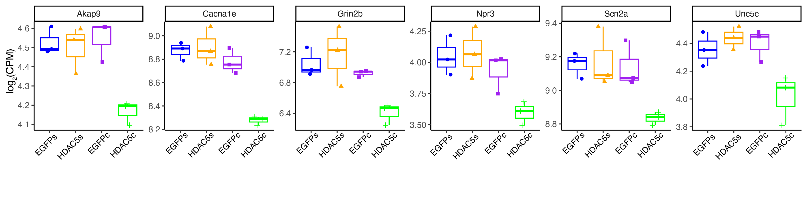

Histone deacetylase 5 in prelimbic prefrontal cortex regulates cocaine-induced gene expression and limits context-associated cocaine seeking behavior.
==========================

This repository contains analysis code for the HDAC5 ~ Cocaine gene expression project carried out by researchers at the [Cowan Lab, MUSC](https://medicine.musc.edu/departments/neuroscience/research/cowan) and [Berto Lab, MUSC](https://bertolab.org/).

## Cite this

If you use anything in this repository please cite the following publication:

URL: 

## Files

| directory | contents | code |
| --------- | -------- | -------- |
| [`futcounts`](futcounts/) | Input data of the initial processing and quality check. | 01_Create_InputData.R|
| [`dge`](dge/) | Output of the Differential expression analysis. | 02_Dge.R \ 03_Convert_ID.R \ 04_DGE_Viz.R \ 05_DGE_GeneOntology.R|
| [`wgcna_output`](wgcna_output/) | Output data of the coexpression analysis. | 06_WGCNA.R \ 07_Module_Visiualization.R|
| [`utils`](utils/) | Utility functions and data. | 08_Enrichment_Modules.sh |
